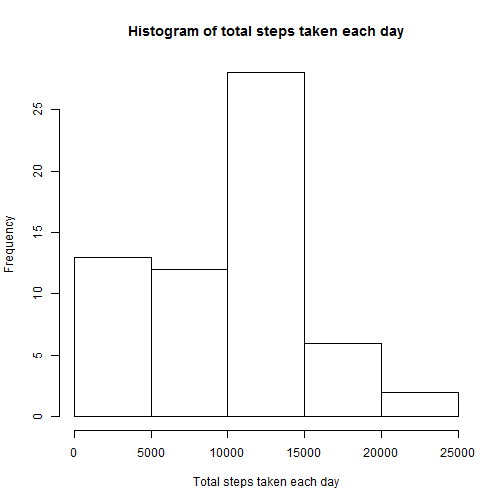
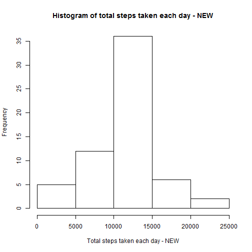
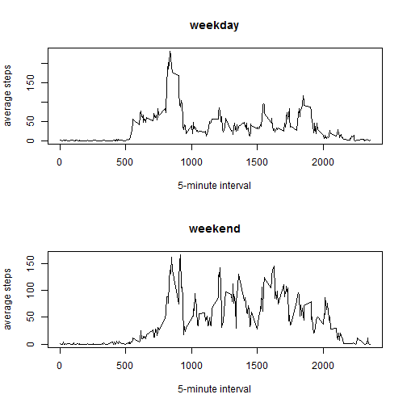

## Assignment I


### PART I  Loading and preprocessing the data

#### 1. Load the data

```r
data <- read.csv(file = "activity.csv", header = T)
```
#### 2. Process/transform the data

```r
data$date <- as.Date(data$date)
```


### PART II What is mean total number of steps taken per day?

#### 1. Calculate the total number of steps taken per day

```r
totalperday <- tapply(data$steps, data$date, sum, na.rm = T)
```
#### 2. Make a histogram of the total number of steps taken each day

```r
par(mfrow = c(1,1))
hist(totalperday, xlab = "Total steps taken each day", 
                  main = "Histogram of total steps taken each day")
```

 

#### 3. Calculate and report the mean and median of the total number of steps taken per day

```r
totalmean <- mean(totalperday)
totalmedian <- median(totalperday)
```

```r
print(totalmean)
```

```
## [1] 9354.23
```

```r
print(totalmedian)
```

```
## [1] 10395
```


### PART III What is the average daily activity pattern?

#### 1. Make a time series plot 
This plot uses 5-minute interval as x-axis and the average number of steps taken, averaged across all days as the y-axis

```r
intervalmean <- tapply(data$steps, data$interval, mean, na.rm = T)
x <- levels(as.factor(data$interval))
plot(x, intervalmean, type = "l", xlab = "5-minute interval", 
                                  ylab = "average number of steps taken")
```

 

#### 2. Which 5-minute interval, on average across all the days in the dataset, contains the maximum number of steps?

```r
maxinterval <- data$interval[which.max(intervalmean)]
print(maxinterval)
```

```
## [1] 835
```


### PART IV  Imputing missing values

#### 1. Calculate and report the total number of missing values in the dataset

```r
missing <- !complete.cases(data)
no.missing <- length(which(missing == T))
print(no.missing)
```

```
## [1] 2304
```
#### 2. Use the mean for that 5-minute interval to fill in the missing values

```r
newsteps <- data$steps
for (i in 1:17568) {
    if (is.na(newsteps[i]) == T) {
        interval <- data$interval[i]
        newsteps[i] = intervalmean[as.character(interval)]
    }
}
newsteps <- round(newsteps)
```
#### 3. Create a new dataset that is equal to the original dataset but with the missing data filled in.

```r
newdata <- data.frame(newsteps, data$date, data$interval)
colnames(newdata) = c("steps", "date", "interval")
```
#### 4. Present the new graph and report the new mean/median

```r
newtotalperday <- tapply(newdata$steps, newdata$date, sum)
hist(newtotalperday, xlab = "Total steps taken each day - NEW", 
                     main = "Histogram of total steps taken each day - NEW")
```

 

```r
newtotalmean <- mean(newtotalperday)
newtotalmedian <- median(newtotalperday)
```

```r
print(newtotalmean)
```

```
## [1] 10765.64
```

```r
print(newtotalmedian)
```

```
## [1] 10762
```
#### 5. Do these values differ from the estimates from the first part of the assignment? What is the impact of imputing missing data on the estimates of the total daily number of steps?
These values differ from the estimates from the first part of the assignment. Imputing missing data using the 5-minute interval mean makes the mean and median of steps taken larger than before.


### PART V  Are there differences in activity patterns between weekdays and weekends?

#### 1. Create a new factor variable in the dataset with two levels.
This is to indicate whether a given date is a weekday or weekend day.

```r
factor <- sapply(newdata$date, weekdays, abbreviate = T)
factor[factor %in% c("Sat", "Sun")] <- "Weekend"
factor[factor %in% c("Mon", "Tue", "Wed", "Thu", "Fri")] <- "Weekday"
factor <- as.factor(factor)
```
Add it to the new dataset

```r
newdata2 <- data.frame(newsteps, data$date, data$interval, factor)
colnames(newdata2) <- c("steps", "date", "interval", "factor")
```
#### 2. Make a panel plot
Compute the intervalmean for weekday and weekend respectively.

```r
newdata_weekday <- newdata2[factor == "Weekday",]
newdata_weekend <- newdata2[factor == "Weekend",]
intervalmean_weekday <- tapply(newdata_weekday$steps, newdata_weekday$interval, mean)
intervalmean_weekend <- tapply(newdata_weekend$steps, newdata_weekend$interval, mean)
x <- levels(as.factor(newdata2$interval))
```
Draw plot.

```r
par(mfrow = c(2,1))
with(newdata2[factor == "Weekday",],
     plot(x, intervalmean_weekday, type = "l",
                           xlab = "5-minute interval", 
                           ylab = "average steps",
                           main = "weekday"))
with(newdata2[factor == "Weekend",],
     plot(x, intervalmean_weekend, type = "l",
                           xlab = "5-minute interval", 
                           ylab = "average steps",
                           main = "weekend"))
```

 
